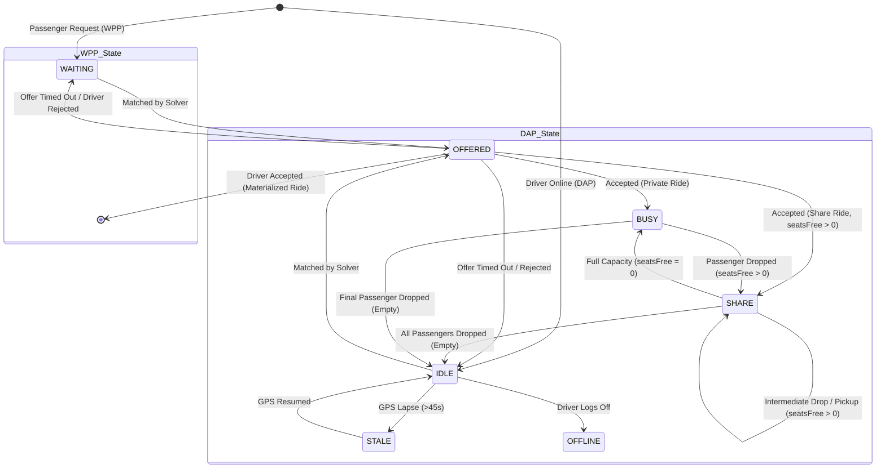

# LiphtUp Pool-Based Dispatch: Sub-Pools, State Machines & Objective Cost Formulation

**Version:** 2.0 (Phase 2 Hardened)  
**Date:** 2026-10-05  
**Subsystem:** LiphtUp Core Dispatch & Fleet Routing  

---

## 1. Pool Schema Overview

The LiphtUp dispatch system manages real-time fleet allocation across distributed, transactional Firestore pools:

### 1.1 Waiting Passenger Pool (`dispatchWPP`)
Tracks active, unserved ride requests awaiting assignment.
- **`id`** (`string`): Passenger user ID or request identifier.
- **`pickup`** (`{lat: float, lng: float, name: string}`): Geocoded origin point.
- **`drop`** (`{lat: float, lng: float, name: string, address: string}`): Geocoded destination point.
- **`req_time`** (`float`): Unix epoch seconds when request entered pool.
- **`state`** (`string`): `WAITING` | `OFFERED`.
- **`wants_share`** (`boolean`): True if user opted into shared carpooling.
- **`seats`** (`integer`): Number of seats requested (default: 1).
- **`fare`** (`float`): Quoted trip fare in INR.
- **`vehicle_type`** (`string`): `auto` | `bike` | `any`.
- **`mode`** (`string`): `auto` | `schedule` | `notify_only`.
- **`current_offer_driver_id`** (`string | null`): Assigned driver ID when `state=OFFERED`.
- **`offer_expires_at`** (`float | null`): Epoch expiration timestamp for outstanding offer.
- **`banned`** (`list[string]`): List of driver IDs ineligible for this passenger (e.g., prior rejections/timeouts).
- **`version`** (`integer`): Monotonically increasing concurrency token.

### 1.2 Driver Availability Pool (`dispatchDAP`)
Tracks active, approved driver supply categorized into sub-pools.
- **`id`** (`string`): Driver user ID.
- **`loc`** (`{lat: float, lng: float}`): Latest GPS telemetry coordinates.
- **`cell`** (`string`): Spatial uniform grid cell hash (0.02° resolution).
- **`pool`** (`string`): `IDLE` | `SHARE` | `BUSY` | `OFFLINE`.
- **`state`** (`string`): `IDLE` | `SHARE_OPEN` | `BUSY` | `OFFERED` | `OFFLINE` | `STALE`.
- **`seatsFree` / `seats_free`** (`integer`): Free seat capacity (0 to `SHARE_MAX_SEATS`, capped at 3).
- **`routeStops` / `route`** (`list[object]`): Ordered list of remaining pickup/drop waypoints.
- **`idle_since`** (`float`): Epoch timestamp when driver entered current idle/available state.
- **`last_seen`** (`float`): Epoch timestamp of most recent GPS heartbeat.
- **`vehicle_type`** (`string`): `auto` | `bike`.
- **`is_approved`** (`boolean`): Verification status.
- **`current_offer_passenger_id`** (`string | null`): Assigned passenger ID when `state=OFFERED`.
- **`offer_expires_at`** (`float | null`): Expiration timestamp for outstanding offer.
- **`version`** (`integer`): Concurrency token.

---

## 2. State Machine Diagram



---

## 3. Objective Cost Formulation & Weight Tuning

The global matching engine evaluates candidate edges using the minimum-cost formula:

$$\text{Cost}(p, d) = \text{ETA} \times (1 + W_{\text{URGENCY}} \times \text{wait}_p) - W_{\text{PAX\_WAIT}} \times \text{wait}_p - W_{\text{DRIVER\_IDLE}} \times \text{idle}_d - W_{\text{FARE}} \times \text{fare\_rate} + \text{detour} - W_{\text{SHARE}}$$

### 3.1 Parameter Reference

| Parameter | Default | Environment Variable | Function & Operational Rationale |
| :--- | :---: | :--- | :--- |
| $W_{\text{URGENCY}}$ | `0.05` | `DISPATCH_W_URGENCY` | Scales pickup ETA penalty by passenger waiting duration. For urgent riders, penalizes distant pickups while promoting nearer matches. |
| $W_{\text{PAX\_WAIT}}$ | `0.50` | `DISPATCH_W_PAX_WAIT` | Direct cost discount per minute of passenger waiting time. Drives anti-starvation by reducing match cost as wait accumulates. |
| $W_{\text{DRIVER\_IDLE}}$ | `0.20` | `DISPATCH_W_DRIVER_IDLE` | Cost discount per minute of driver idle duration. Promotes long-waiting drivers over recently freed drivers when equidistant. |
| $W_{\text{FARE}}$ | `0.10` | `DISPATCH_W_FARE` | Prioritizes higher fare-per-minute trips during constrained fleet supply to maximize aggregate driver earnings. |
| $W_{\text{SHARE\_BONUS}}$ | `2.00` | `DISPATCH_W_SHARE_BONUS` | Direct bonus discount applied when a share-requesting passenger matches a driver in `pool=SHARE`, incentivizing vehicle utilization. |
| $W_{\text{DETOUR}}$ | `1.00` | `DISPATCH_W_DETOUR` | Multiplier applied to total route detour minutes computed by `detour_penalty(p, d)`. |

---

## 4. Detour Penalty Formulation for Shared Rides

When matching passenger $p$ with an active share driver $d$:
1. **Valid Permutations**: Passenger pickup $P$ is inserted before drop $D$ across the driver's existing remaining `routeStops` $[S_0, \dots, S_{k-1}]$. Existing riders' drops strictly retain their relative order.
2. **Onboard Rider Delay**: For each onboard rider $r$ with remaining baseline drop arrival $T_{\text{orig}}(r)$, the new arrival time $T_{\text{new}}(r)$ is evaluated.
3. **Hard Rejection Constraints**:
   - The edge is rejected if $\text{ExtraTime}(r) > \text{MAX\_DETOUR\_MIN}$ (default: 8.0 min).
   - The edge is rejected if $\text{ExtraTime}(r) > \text{MAX\_DETOUR\_PCT} \times T_{\text{orig}}(r)$ (default: 33%).
4. **Aggregate Detour Penalty**:
   $$\text{DetourPenalty}(p, d) = \sum_{r \in \text{onboard}} \text{ExtraTime}(r) + \text{DriverAddedMinutes}$$

---

## 5. Changing Service-Area-Dependent Configuration

All regional geometric and operational parameters are strictly configured via environment variables and isolated in `api/dispatch/config.py`:

```bash
# Service Area Parameters
DISPATCH_AVG_SPEED_KMH=25.0           # Regional average speed for Agartala urban core
DISPATCH_BASE_MAX_ETA_MIN=8.0         # Initial search radius ETA cap
DISPATCH_MAX_ETA_GROWTH_RATE=0.5      # Expansion rate: +0.5 min ETA per min wait
DISPATCH_CAP_MAX_ETA_MIN=25.0         # Absolute upper bound for pickup ETA
DISPATCH_GRID_CELL_SIZE_DEG=0.02      # Spatial grid discretization (~2.2 km)
DISPATCH_DEFAULT_SEARCH_RADIUS_KM=5.0 # Spatial candidate filter radius
DISPATCH_MAX_RADIUS_KM=15.0           # Maximum operational radius

# Operational Caps
DISPATCH_MAX_PAX_PER_RUN=50           # Maximum passengers evaluated per runner loop
DISPATCH_MAX_COMPONENT_PAX=20         # Maximum component size for Hungarian solver
DISPATCH_RUN_TIME_BUDGET_MS=1000.0    # Solver execution budget in milliseconds
```
